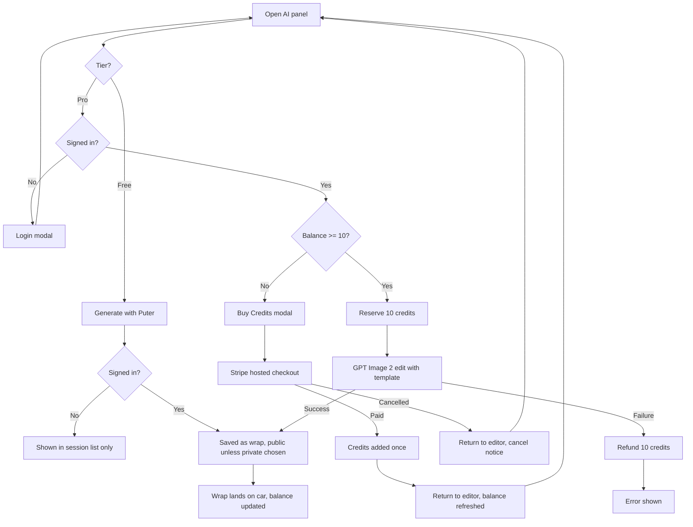

# AI generation on GPT Image 2 with paid credits — Specification

## Problem Statement
A designer in the wrap editor asks the AI panel for a wrap and gets one of three providers. Gemini produces results nobody wants. The OpenAI option runs an older model and never sees the wrap template, so its output is a loose picture rather than a design laid on the car's panels. Every OpenAI image costs the site owner money with no way for the designer to pay for it. Whatever is generated disappears when the tab closes.

## Solution
The AI panel offers two tiers. **Free** is the current Puter generator, unchanged, open to anyone. **Pro** runs GPT Image 2 with the car's wrap template as the input image and costs 10 credits. A signed-in designer buys credit packs through a hosted Stripe checkout, sees the balance in the panel and the user menu, and finds every generation saved in My Generations and shared to the community gallery. A designer who has ever bought credits can keep a generation private.

## User Stories
1. As a signed-in designer, I want Pro generations to follow the real wrap template, so that the result fits the car's panels instead of inventing a sheet.
2. As a signed-in designer, I want to buy credits and spend them on Pro generations, so that I can use the better model without the site owner paying for me.
3. As a signed-in designer, I want my generations kept on the server, so that I can reload them after the session ends.
4. As a paying designer, I want to keep a generation out of the public gallery, so that my design stays mine.
5. As the site owner, I want Gemini gone and every paid call backed by credits, so that the AI feature has no unpaid cost path.

## Acceptance Criteria

**Provider changes**
- **AC1:** Given the AI panel, When it renders, Then it offers exactly two tiers, Free and Pro, and no Gemini option exists anywhere in the client, server, dependencies, or environment.
- **AC2:** Given a signed-in designer with at least 10 credits, When they generate on Pro, Then the request uses GPT Image 2 with the current car's template as the input image at high quality, and the result lands on the car.
- **AC3:** Given an anonymous visitor, When they generate on Free, Then behaviour is unchanged from today: no login, no credits, result shown in the session-only list, nothing written to the server.

**Credits**
- **AC4:** Given a signed-in designer with fewer than 10 credits, When they open the Pro tier, Then Generate is disabled and Buy Credits is highlighted.
- **AC5:** Given a visitor who is not signed in, When they select Pro, Then the login modal opens.
- **AC6:** Given a Pro generation, When it starts, Then 10 credits are reserved before the model is called; When the call fails, Then the 10 credits are returned; When two requests race, Then the balance never goes below zero.
- **AC7:** Given a signed-in designer, When they view the AI panel or the user menu, Then the current balance is shown and it updates after a generation or a purchase.
- **AC8:** Given a new account, When it is created, Then its balance is zero.

**Purchase**
- **AC9:** Given a signed-in designer, When they open Buy Credits, Then three packs are offered: 50 credits for $5, 120 for $10, 300 for $20, in USD.
- **AC10:** Given a pack chosen, When the designer completes the hosted Stripe checkout, Then the credits are added exactly once, the designer is marked as having purchased, and a replayed or duplicate payment event adds nothing further.
- **AC11:** Given a completed payment event whose amount or currency does not match the order, When it arrives, Then no credits are added and the order is marked failed.
- **AC12:** Given checkout completes, When Stripe returns the designer to the site, Then the editor opens, shows a success message, and the balance reflects the purchase within a few seconds. When the designer cancels, Then a cancel message shows and the balance is unchanged.

**Persistence and visibility**
- **AC13:** Given a signed-in designer, When any generation (Free or Pro) succeeds, Then it is saved as a wrap owned by them, named from the prompt, tagged with the current car model, with the image stored in the media bucket.
- **AC14:** Given a signed-in designer who has never purchased, When they look at Share to Gallery, Then it is checked and locked with a hint to purchase; their generations are public.
- **AC15:** Given a signed-in designer who has purchased, When they untick Share to Gallery and generate, Then the wrap is private: absent from every public listing (gallery, home wall, hero, 3D gallery, studio shelf, pre-render batch) and present in My Generations and My Garage.
- **AC16:** Given a signed-in designer, When they open My Generations, Then it lists their saved AI generations from the server, newest first, public and private alike.

## User Journey

## Test Points
Highest seam first.
1. **Pack and cost table** (pure module): the three packs, their prices and credits, the per-generation cost, and pack lookup by id. Proves AC8 pricing contract and AC9.
2. **Payment settlement decision** (pure function over an order and a payment event): returns paid, duplicate, or mismatch. Proves AC10 idempotency and AC11 amount check without a database.
3. **Public listing filter** (pure helper that builds the visibility match): private wraps excluded, legacy wraps without the flag included. Proves AC15 across every listing that reuses it.

The credit reserve and refund are single atomic database updates whose correctness lives in the query condition; they are exercised in the UI loop with Stripe test mode rather than unit tested.

## Implementation Decisions
- Gemini removed entirely: server route, client branch, SDK dependency, environment key, translations.
- Pro tier calls the OpenAI image **edit** endpoint with model `gpt-image-2`, the template PNG as the input image, quality high, one image, PNG output. The template is sent by the client as it is today for the Free tier, so the server needs no knowledge of car templates.
- The Pro route requires authentication. It reserves credits with a conditional atomic decrement (balance at least the cost), calls the model, uploads the result to the media bucket, creates the wrap, records the spend, and returns the image URL and new balance. On any failure after the reserve it refunds and records the refund.
- Free tier generations by signed-in designers are saved from the client through the existing wrap upload endpoint, which gains three optional fields: source, prompt, and visibility. Anonymous Free generations are not saved.
- Wrap gains `source` (upload or ai, default upload), `isPublic` (default true), and `prompt`. Every public listing and the pre-render batch exclude wraps whose visibility is false; wraps without the flag are treated as public.
- User gains `credits` (integer, default 0, never negative) and `hasPurchased` (default false). Login, register, and the current-user endpoint return both.
- Credit ledger: one transactions collection with type purchase, consume, or refund, the signed amount, the balance after, and an optional order reference.
- Payments follow the partner project's design ported to Express: an order record is created pending, a Checkout session is created with an inline price and the order id in metadata, the webhook marks the order paid once and adds credits, an expired session marks the order expired, and the client polls the order after redirect. Packs live in one server constant; nothing is configured in the Stripe dashboard except the webhook endpoint.
- The webhook needs the raw request body for signature verification; the existing JSON body parser is asked to retain it.
- Return URLs point at the app root with query parameters naming the outcome and order; the app opens the editor when it sees them and clears them from the address bar.
- The provider selector becomes a two-way Free / Pro toggle. The Generate button shows the cost on Pro. Balance shows under it and in the user menu. Share to Gallery is a checkbox, locked on for designers who have not purchased.
- My Generations, when signed in, loads the designer's own wraps filtered to AI source through the existing garage endpoint, which gains a source filter.
- Existing latent defect fixed first as prefactoring: the current-user endpoint wraps the user in an envelope the client stores whole, so a reloaded session has no username or id. The client unwraps it and gains a refresh function.

## Testing Decisions
- Vitest is added at the repo root with a single `test` script. Tests attach only at the three test points above and assert external behaviour: given inputs, expected outputs.
- No browser E2E. UI changes are verified by driving the running app and capturing screenshots per changed view, which go on the PR.
- Prior art: none. The repo has no tests today. Stack conventions follow the server's CommonJS style.

## Dependencies
- `stripe` (server, root package.json). `vitest` (dev).
- `@google/generative-ai` removed.
- Environment: `STRIPE_SECRET_KEY`, `STRIPE_WEBHOOK_SECRET`, `APP_PUBLIC_URL`; `GEMINI_API_KEY` removed.
- Owner actions at deploy: set the three variables on Railway; register the webhook endpoint in the Stripe dashboard for the completed and expired checkout events.

## Out of Scope
- Reference-image tab (img2img from a user upload).
- AI badge on gallery cards.
- Deleting or refactoring `TeslaStudio.tsx`.
- Starter or promotional credits, admin credit grants, refunds or dispute handling.
- PayPal or any second processor.
- Subscriptions.
- Persisting anonymous generations.

## Further Notes
- The Free tier's Puter result is expected to be a data URL, which the client can turn into a file for upload. If a Puter result ever arrives as a remote URL the client cannot read, that generation stays session-only and the failure is logged, not shown as an error.
- Stripe is used in test mode until the owner supplies live keys.
