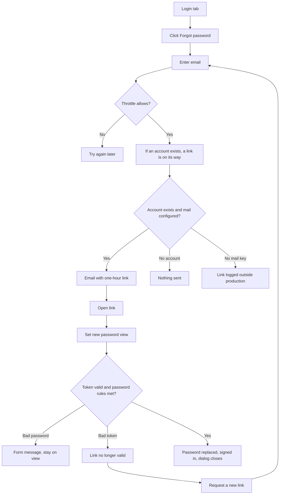

# Forgot password / reset by email — Specification

## Problem Statement
A designer who has forgotten their password cannot get back into their account. The login dialog offers only Login and Register, and there is no recovery path of any kind. Since accounts now carry purchased credits and saved generations, a forgotten password means losing paid-for value.

## Solution
The login tab gains "Forgot password?". The designer types their email and always sees the same reassurance: if an account exists, a link is on its way. The email holds a link that opens the app on a "Set new password" view. A new password of at least eight characters, typed twice, signs the designer straight in. Links last one hour and work once; an old or used link says so and offers a fresh one.

## User Stories
1. As a designer who forgot my password, I want to request a reset link by email, so that I can get back into my account without contacting anyone.
2. As a designer holding a reset link, I want to set a new password and be signed in at once, so that recovery ends in the editor, not on another login form.
3. As the site owner, I want recovery to reveal nothing about which emails are registered and to resist abuse, so that the feature cannot be turned into an enumeration or spam tool.

## Acceptance Criteria
- **AC1:** Given the login tab, When it renders, Then a "Forgot password?" link appears under the password field and opens a view asking only for an email address.
- **AC2:** Given the forgot view, When any well-formed email is submitted, whether registered or not, Then the same message appears: "If an account exists for that address, a reset link is on its way."
- **AC3:** Given a registered email, When the forgot form is submitted, Then an email is sent to that address containing a link to the app with a single-use token that expires one hour later.
- **AC4:** Given the mail service is not configured, When a reset is requested, Then outside production the server logs the link; in production it logs an error; in both cases the designer still sees the AC2 message.
- **AC5:** Given the same address or the same client requests more than three links within fifteen minutes, When the fourth request arrives, Then it is refused with a "try again later" message and no email is sent.
- **AC6:** Given a reset link is opened, When the app loads, Then the login dialog opens on "Set new password" with password and confirm fields, and the token is removed from the address bar.
- **AC7:** Given the reset view, When the new password is shorter than eight characters or the two fields differ, Then the form refuses with a clear message and nothing is sent.
- **AC8:** Given a valid token and a valid new password, When submitted, Then the password is replaced, the token is cleared, the designer is signed in, and the dialog closes.
- **AC9:** Given a token that is expired, already used, or unknown, When a new password is submitted, Then the view explains the link is no longer valid and offers a "Request a new link" button that returns to the forgot view.
- **AC10:** Given a second reset request for the same account, When it is made, Then only the newest link works; the older one is treated as invalid.
- **AC11:** Given the old password, When the designer tries to log in after a successful reset, Then login fails; the new password succeeds.
- **AC12:** Given the database, When inspected, Then only a hash of the token is stored, never the token itself.

## User Journey

## Test Points
Highest seam first.
1. **Token helpers** (pure): create a token and its hash; verify a presented token against a stored hash and expiry, returning valid, expired, or unknown. Proves AC3 lifetime, AC9, AC10, AC12.
2. **Throttle decision** (pure over an injected clock and map): allow or refuse the nth request per key within the window. Proves AC5.
3. **Reset email content** (pure): subject, text, and HTML built from a link; the link is present verbatim. Proves AC3's content.

The HTTP round trips, the database writes, and the Resend call are exercised by driving the running app with a throwaway account and, with no API key locally, by reading the logged link.

## Implementation Decisions
- Two new endpoints on the auth router: request a reset (email in, generic message out) and perform a reset (token and new password in, login token and user out). Both public.
- User gains a reset token hash and a reset token expiry. A new request overwrites both, which is what makes the older link invalid. A successful reset clears both.
- Tokens are 32 random bytes rendered as hex; the stored value is their SHA-256. Lookup is by hash and by expiry greater than now, so expired and used tokens are indistinguishable from unknown ones, which is the intended message.
- Mail goes through Resend's HTTPS endpoint with Node's built-in fetch. From address comes from `MAIL_FROM`, defaulting to the shared onboarding sender. The link base is `APP_PUBLIC_URL`, falling back to the request origin outside production.
- Throttle is an in-memory map keyed by lowercased email and by client address, three per fifteen minutes, pruned on each call. A restart resets it; that is the accepted ceiling for a single-process server.
- The login dialog gains two views beside login and register: forgot and reset. It follows the file's existing convention of English strings, so no translation keys are added; the intent's "UI strings in both languages" applies to translated surfaces, which this dialog is not.
- The dialog module reads the reset token from the URL once at load. The user menu, which owns the dialog, opens it when a token is present; the dialog starts on the reset view and cleans the address bar when it first renders.
- The forgot endpoint responds after the lookup and send complete, but with the same body regardless of outcome. Timing differences are accepted; the throttle bounds probing.

## Testing Decisions
- Vitest, node environment, alongside the existing server tests: token helpers, throttle decision, email content. Behaviour only: inputs in, decisions out; no mocking of Mongo or Resend.
- Manual loop on the running app with a throwaway account: request, read the logged link (no API key locally), open it, set a password, confirm sign-in, confirm the old password fails, confirm a reused link fails. Screenshots of forgot view, generic message, reset view, invalid-link view, and signed-in state go on the PR.
- One real Resend send once the owner supplies an API key; until then that step is listed unverified.

## Dependencies
- None new. Node 24 fetch and crypto.
- Environment: `RESEND_API_KEY`, `MAIL_FROM`; existing `APP_PUBLIC_URL`.
- Owner: verify the sending domain in Resend or accept the onboarding sender for testing; set both variables on Railway.

## Out of Scope
- Invalidating existing 7-day login sessions on password change (password-version check) — follow-up because accounts hold credits.
- Email verification at registration.
- Changing password while logged in (account settings).
- Username-based recovery, SMS, or security questions.
- Rate limiting on any other endpoint.
- Registration password rules.

## Further Notes
- Resend's shared onboarding sender delivers only to the account owner's own email; real users need a verified domain in `MAIL_FROM`.
- The existing register handler signs its own JWT instead of using the file's helper; the reset endpoint uses the helper and leaves register untouched.
